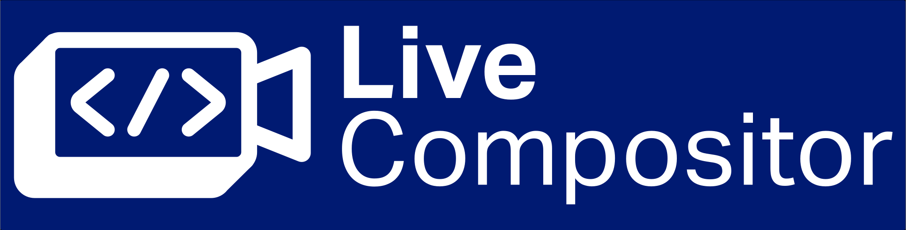

<h1 align="center">
  

  <a href="https://compositor.live/docs">Documentation</a> |
  <a href="">Discord</a>
</h1>

LiveCompositor is an open-source media server for real-time, low-latency, programmable video and audio mixing.

LiveCompositor targets real-time use cases, with significant focus on situations where latency is critical. It is a great fit
for any video conferencing, live-streaming, or broadcasting solutions where you need to operate in any way on an uncompressed video.
However, you can also use it for non-real-time use cases, for example, apply some effect on a video from a MP4 file and write the output
to the new MP4.

We don't have plans to introduce any major breaking changes in the API in the foreseeable future.

## Where to start?

Check out our [`Getting started`](https:://compositor.live/docs/intro) section.

LiveCompositor supports Linux and macOS and can be used in 2 ways:
- Standalone media server - [`compositor.live/docs`](https:://compositor.live/docs/intro).
- Element in a Membrane Framework pipeline - [github.com/membraneframework/membrane_live_compositor_plugin](https://github.com/membraneframework/membrane_live_compositor_plugin).

## Demos

https://github.com/membraneframework/live_compositor/assets/104033489/e6f5ba7c-ab05-4935-a42a-bc28c42fc895

This is just a sample of effects that you can achieve with LiveCompositor. It is a compilation of a few demo projects
written in TypeScript that you can find in [`demos`](./demos) directory.

## Copyright

Copyright 2024, [Software Mansion](https://swmansion.com/?utm_source=git&utm_medium=readme&utm_campaign=live_compositor)

